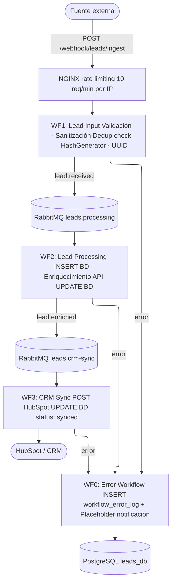
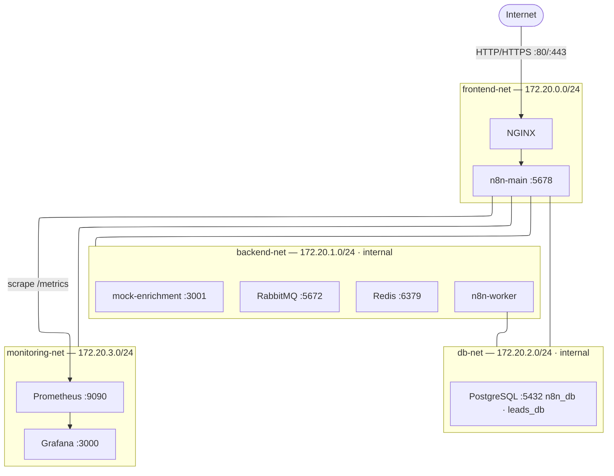
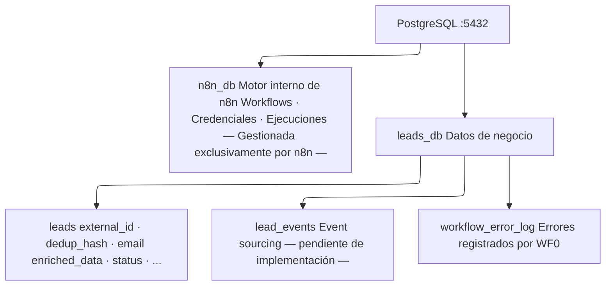
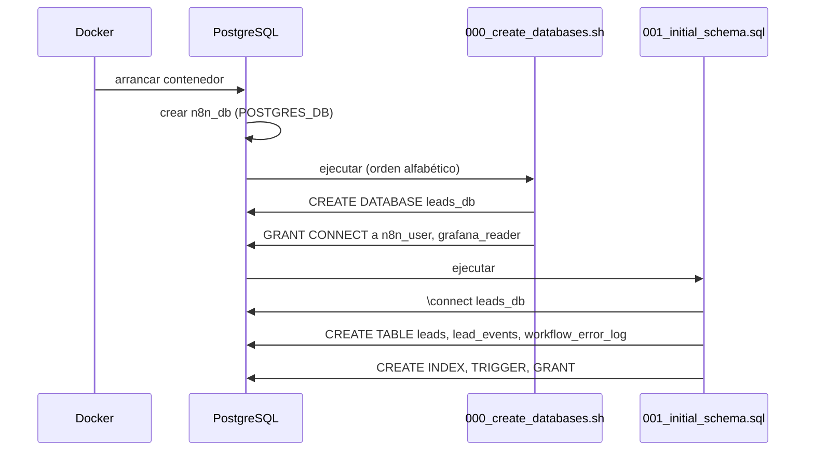
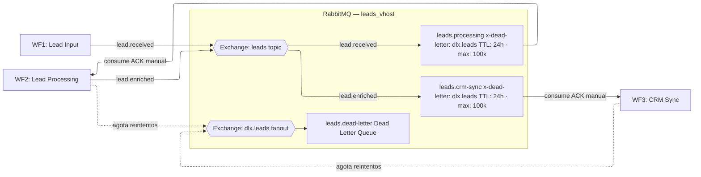
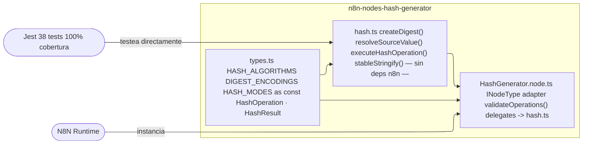
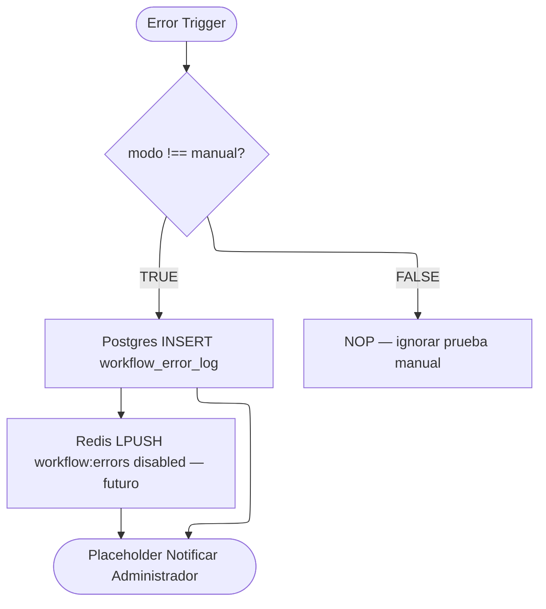
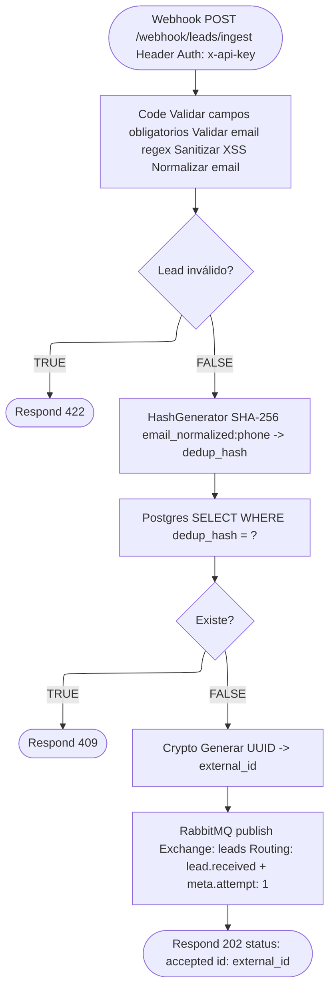
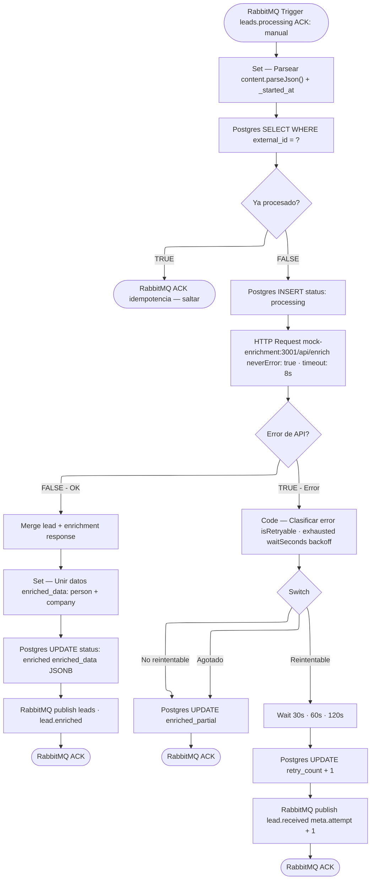
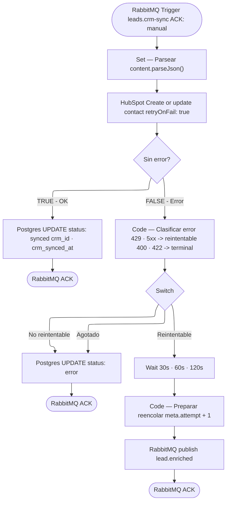

# Documentación Técnica
## Sistema de Procesamiento de Leads con N8N
**Fecha:** Marzo 2026
**Versión:** 1.0.0

---

## Índice

1. [Resumen Ejecutivo](#1-resumen-ejecutivo)
2. [Arquitectura General](#2-arquitectura-general)
3. [Stack Tecnológico](#3-stack-tecnológico)
4. [Estructura del Repositorio](#4-estructura-del-repositorio)
5. [Infraestructura Docker](#5-infraestructura-docker)
6. [Base de Datos](#6-base-de-datos)
7. [Sistema de Colas — RabbitMQ](#7-sistema-de-colas--rabbitmq)
8. [Nodo Personalizado — HashGenerator](#8-nodo-personalizado--hashgenerator)
9. [Workflows N8N](#9-workflows-n8n)
10. [Seguridad](#10-seguridad)
11. [Observabilidad](#11-observabilidad)
12. [DevOps y Despliegue](#12-devops-y-despliegue)
13. [Decisiones Técnicas](#13-decisiones-técnicas)
14. [Mejoras Futuras](#14-mejoras-futuras)
15. [Limitaciones Conocidas](#15-limitaciones-conocidas)

---

## 1. Resumen

El sistema implementa un **pipeline event-driven de procesamiento de leads** sobre n8n en modo cola (queue mode). Gestiona el ciclo de vida completo de un lead desde su recepción hasta su sincronización con HubSpot, pasando por validación, deduplicación, enriquecimiento y persistencia.

### Flujo de alto nivel



---

## 2. Arquitectura General

### Diagrama de redes Docker



### Principios de diseño

- **Event-driven**: los workflows se comunican exclusivamente vía colas RabbitMQ, nunca directamente entre sí
- **At-least-once delivery**: ACK manual en todos los consumers — si un workflow falla, RabbitMQ reencola
- **Idempotencia**: comprobación de `external_id` antes de procesar para tolerar mensajes duplicados
- **Separación de responsabilidades**: cada workflow tiene una única responsabilidad clara
- **Fail-fast en configuración**: validación de enums en el custom node antes de procesar items

---

## 3. Stack Tecnológico

| Componente | Tecnología | Versión | Rol |
|---|---|---|---|
| Orquestador de workflows | N8N | latest | Motor principal |
| Reverse proxy | NGINX | stable-alpine | Rate limiting + punto de entrada |
| Base de datos | PostgreSQL | 17.5-alpine | Persistencia de leads y errores |
| Cola de mensajes | RabbitMQ | management | Pipeline asíncrono entre workflows |
| Caché / Cola interna | Redis | latest | Bull Queue (n8n) |
| Métricas | Prometheus | v3.10.0 | Scraping de métricas n8n |
| Dashboards | Grafana | 13.x | Visualización de métricas |
| API mock | Mockoon CLI | latest | Simulación enriquecimiento + CRM |
| CRM real | HubSpot | API v2 | Destino de sincronización |
| Lenguaje custom node | TypeScript | 5.4.5 | Nodo personalizado HashGenerator |

---

## 4. Estructura del Repositorio

```
./
│
├── docker-compose.yml
├── deploy.sh
├── .env.n8n / .env.postgres / .env.redis / .env.rabbitmq
│
├── n8n/
│   ├── custom-nodes/
│   │   └── n8n-nodes-hash-generator/
│   │       ├── src/nodes/HashGenerator/
│   │       │   ├── types.ts          ← Tipos con 'as const' (sin any)
│   │       │   ├── hash.ts           ← Lógica pura testeable
│   │       │   └── HashGenerator.node.ts
│   │       └── src/__tests__/HashGenerator.test.ts
│   └── workflows/
│       ├── Error_Workflow.json
│       ├── Lead_Input_WF.json
│       ├── Lead_Processing_WF.json
│       └── Sincronizacion_CRM.json
│
├── postgres/migrations/
│   ├── 000_create_databases.sh
│   └── 001_initial_schema.sql
│
├── rabbitmq/
│   ├── rabbitmq.conf
│   └── entrypoint-init.sh
│
├── nginx/nginx.conf
├── mockoon/enrichment-mock.json
│
├── monitoring/
│   ├── prometheus/prometheus.yml
│   └── grafana/
│       ├── datasources/prometheus.yml
│       └── dashboards/n8n-leads.json
│
└── scripts/build-custom-nodes.sh
```

---

## 5. Infraestructura Docker

### Servicios y redes

El stack define **4 redes Docker** con segmentación por función:

| Red | CIDR | `internal` | Servicios |
|---|---|---|---|
| `frontend-net` | 172.20.0.0/24 | No | NGINX, n8n-main |
| `backend-net` | 172.20.1.0/24 | Sí | n8n-main, n8n-worker, Redis, RabbitMQ, mock |
| `db-net` | 172.20.2.0/24 | Sí | n8n-main, n8n-worker, PostgreSQL |
| `monitoring-net` | 172.20.3.0/24 | No | Prometheus, Grafana, n8n-main |

`internal: true` impide que los contenedores en esas redes accedan a internet o sean accesibles desde fuera del host, limitando la superficie de ataque.

### Hardening aplicado

- `no-new-privileges:true` en todos los servicios
- Usuarios no-root explícitos (node=1000, postgres=70, redis=999)
- `read_only: true` en PostgreSQL y Prometheus
- `/tmp` en tmpfs (RAM) en todos los servicios
- Comandos peligrosos de Redis renombrados a cadena vacía: `FLUSHDB`, `FLUSHALL`, `DEBUG`

### NGINX — Rate Limiting

```nginx
limit_req_zone $binary_remote_addr zone=webhook_limit:10m rate=10r/m;
limit_req_zone $binary_remote_addr zone=global_limit:10m  rate=100r/s;
```

- **Webhook de ingesta**: máx 10 req/min por IP, burst de 20
- **UI y resto**: 100 req/s con burst de 120
- Respuesta 429 con JSON estructurado cuando se supera el límite
- `/webhook-test` sin rate limiting (uso en desarrollo)

---

## 6. Base de Datos

### Dos bases de datos en un servidor PostgreSQL



La separación garantiza que los datos de negocio no se mezclen con la operativa interna de n8n y que puedan migrarse a instancias independientes en producción sin cambios en el código.

### Tabla `leads` — campos clave

| Campo | Tipo | Descripción |
|---|---|---|
| `external_id` | TEXT UNIQUE | UUID v4 generado en WF1. Identificador del pipeline. |
| `dedup_hash` | TEXT UNIQUE | SHA-256(email_normalizado + ":" + teléfono). Previene duplicados. |
| `email` | CITEXT | Case-insensitive. Permite búsquedas sin normalizar. |
| `email_normalized` | TEXT | Lowercase + trim. Usado para el dedup_hash. |
| `enriched_data` | JSONB | Respuesta completa de la API de enriquecimiento. Flexible ante cambios de API. |
| `status` | TEXT | Enum: received -> processing -> enriched -> synced / error |
| `ingested_at` | TIMESTAMPTZ | Cuándo llegó al webhook (WF1). |
| `created_at` | TIMESTAMPTZ | Cuándo se insertó en BD (WF2). Puede diferir por carga en cola. |
| `raw_payload` | JSONB | Payload original inmutable. Para auditoría y reprocesos. |

### Mecanismo de inicialización



Para entornos ya en producción se recomienda **golang-migrate** o **Flyway** en lugar de `initdb.d`.

### Usuarios y permisos

| Usuario | Permisos | Usado por |
|---|---|---|
| `postgres` | Superusuario | Solo init |
| `n8n_user` | SELECT/INSERT/UPDATE/DELETE en leads_db + ALL en n8n_db | n8n workflows |
| `grafana_reader` | SELECT en leads_db | Grafana (futuro) |

---

## 7. Sistema de Colas — RabbitMQ

### Topología



### Configuración de colas

Todas las colas de procesamiento tienen:
- `x-dead-letter-exchange: dlx.leads` — mensajes no procesables van a DLQ
- `x-message-ttl: 86400000` — TTL de 24h
- `x-max-length: 100000` — límite de mensajes en cola

### Usuarios

| Usuario | Permisos | Uso |
|---|---|---|
| `rabbitmq_admin` | administrator | Gestión vía Management UI |
| `n8n_producer` | configure/write/read en `^(leads\|dlx).*` | n8n workflows |

Las credenciales se generan dinámicamente en `entrypoint-init.sh` a partir de las variables de entorno, evitando credenciales hardcodeadas en el repositorio.

### ACK Manual

Todos los consumers (WF2, WF3) usan `acknowledge: laterMessageNode`. El mensaje solo se confirma tras completar el procesamiento (incluyendo la escritura en BD). Si el workflow falla, RabbitMQ reencola automáticamente.

---

## 8. Nodo Personalizado — HashGenerator

### Propósito

Genera digests criptográficos deterministas para deduplicación de leads. Implementado como custom node de n8n en TypeScript.

### Capacidades

| Parámetro | Opciones |
|---|---|
| Algoritmo | MD5, SHA-1, SHA-256, SHA-384, SHA-512 |
| Modo | Campo específico · Payload completo · Expresión libre |
| Codificación | Hex · Base64 · Base64 URL-safe |
| Operaciones | N hashes en un solo paso del nodo |

### Arquitectura en 3 capas



**Decisión de diseño clave**: la separación entre `hash.ts` (lógica pura) y `HashGenerator.node.ts` (adaptador n8n) permite testear el 100% de la lógica de negocio sin mockear el contexto de n8n.

### Cobertura de tests

```
Test Suites: 1 passed    Tests: 38 passed
Statements:  100%        Functions: 100%
Lines:       100%        Branches:  94.4% (mínimo: 90%)
```

### Uso en el pipeline

En WF1 (Lead Input), el HashGenerator calcula el `dedup_hash` antes de consultar la BD:

```
Modo:            Expresión libre
Valor:           ={{ $json.lead.email_normalized + ':' + $json.lead.phone.replace(/\s+/g, '') }}
Algoritmo:       SHA-256
Codificación:    Hex
Campo de salida: dedup_hash
```

---

## 9. Workflows N8N

### WF0 — Error Workflow

**Trigger**: Error Trigger (automático cuando cualquier workflow configurado falla)



**Campos registrados**: workflow_id, workflow_name, execution_id, node_name, error_message, error_stack, payload completo.

---

### WF1 — Lead Input Workflow

**Trigger**: Webhook POST `/webhook/leads/ingest` con Header Auth (X-API-Key)



**Respuestas HTTP**:

| Código | Situación |
|---|---|
| 202 | Lead aceptado y encolado |
| 409 | Lead duplicado (dedup_hash ya existe) |
| 422 | Datos inválidos |
| 429 | Rate limit superado (devuelto por NGINX) |
| 401 | API key inválida (devuelto por n8n Header Auth) |

---

### WF2 — Lead Processing Workflow

**Trigger**: RabbitMQ Trigger en cola `leads.processing` (ACK manual)



**Estrategia de reintentos**: intento 1 -> 30s -> intento 2 -> 60s -> intento 3 -> `enriched_partial`.
**Rate limiting 429**: lee `Retry-After` o espera 60s por defecto.

---

### WF3 — Sincronización CRM

**Trigger**: RabbitMQ Trigger en cola `leads.crm-sync` (ACK manual)



**Campos sincronizados con HubSpot**: email, first_name, last_name, phone, company, source, role, linkedin (de enriched_data).

**Errores terminales**: 400, 401, 403, 422.
**Errores reintentables**: 429, 500+, timeout.

---

## 10. Seguridad

### Autenticación del webhook

El nodo Webhook usa **Header Auth** de n8n — verifica el header `x-api-key` antes de ejecutar cualquier nodo. El rechazo devuelve 401 automáticamente sin exponer lógica interna.

Adicionalmente, el nodo Code valida el payload como defensa en profundidad.

### Gestión de secretos

Todos los secretos viven en archivos `.env.*` que están en `.gitignore`. El repositorio solo contiene `.env.example.*` con valores placeholder.

Para producción se recomienda **HashiCorp Vault** o **AWS Secrets Manager** inyectando los valores en el arranque del contenedor.

### Sanitización

El nodo Code de WF1 elimina tags HTML de todos los campos de texto antes de procesarlos, previniendo inyecciones XSS en datos almacenados.

### Aislamiento de red

Los servicios de BD y colas solo son accesibles desde la red interna Docker. No tienen puertos expuestos al host excepto RabbitMQ Management UI en `127.0.0.1:15672`.

---

## 11. Observabilidad

### Métricas — Prometheus

N8N expone métricas en `/metrics` con `N8N_METRICS=true`. Prometheus las recolecta cada 15s.

| Métrica | Tipo | Descripción |
|---|---|---|
| `n8n_workflow_executions_total` | Counter | Ejecuciones por workflow y estado |
| `n8n_workflow_execution_duration_seconds` | Histogram | Duración con percentiles P50/P95/P99 |
| `n8n_active_workflows_total` | Gauge | Workflows activos en este momento |
| `n8n_webhook_calls_total` | Counter | Llamadas al webhook recibidas |

### Dashboards — Grafana

El dashboard `N8N — Pipeline de Leads` incluye: total de ejecuciones, total de errores, workflows activos, duración P95 por workflow, tasa de ejecuciones y webhook calls/s.

Acceso: `http://localhost:3000`

### Logs de errores en BD

El workflow WF0 registra todos los errores de producción en `leads_db.workflow_error_log` con stack trace completo, facilitando el debugging sin acceder a los logs del contenedor.

---

## 12. DevOps y Despliegue

### Primer arranque

```bash
# 1. Configurar variables de entorno
cp .env.example.n8n .env.n8n && cp .env.example.postgres .env.postgres
cp .env.example.redis .env.redis && cp .env.example.rabbitmq .env.rabbitmq
# Editar cada fichero con valores reales

# 2. Compilar custom nodes
chmod +x scripts/build-custom-nodes.sh && ./scripts/build-custom-nodes.sh

# 3. Levantar el stack
./deploy.sh

# 4. Importar workflows (n8n UI -> Settings -> Import Workflows)

# 5. Activar en orden: Error WF -> Lead Processing -> CRM Sync -> Lead Input

### Compilación de custom nodes

```bash
./scripts/build-custom-nodes.sh          # Compilación normal
./scripts/build-custom-nodes.sh --watch  # Modo watch (desarrollo)
```

### Variables de entorno críticas

| Variable | Descripción |
|---|---|
| `N8N_ENCRYPTION_KEY` | Clave de cifrado de credenciales. Generar: `openssl rand -base64 32` |
| `N8N_USER_MANAGEMENT_JWT_SECRET` | JWT para gestión de usuarios |
| `DB_POSTGRESDB_PASSWORD` | Misma que `APP_DB_PASSWORD` en `.env.postgres` |
| `QUEUE_BULL_REDIS_PASSWORD` | Misma que `REDIS_PASSWORD` en `.env.redis` |

---

## 13. Decisiones Técnicas

### N8N en modo queue con workers separados
**Decisión**: `EXECUTIONS_MODE=queue` con n8n-main + n8n-worker.
**Motivo**: escalabilidad horizontal — añadir workers sin tocar el main. SQLite no es compatible con este modo.

### Dos bases de datos en un servidor PostgreSQL
**Decisión**: `n8n_db` para el motor, `leads_db` para negocio.
**Motivo**: aislamiento lógico sin complejidad de dos servidores. Separables en instancias RDS en producción.

### Redis (Bull) + RabbitMQ coexistiendo
**Decisión**: Redis para la cola interna de n8n, RabbitMQ para el pipeline de negocio.
**Motivo**: n8n requiere Redis/Bull en modo queue. RabbitMQ aporta exchanges topic, routing keys, DLQ y TTL que Redis no provee.

### Imagen oficial n8n + volumen para custom nodes
**Decisión**: No construir imagen Docker derivada. Volumen montado `:ro`.
**Motivo**: actualizaciones independientes, menor superficie auditada, CI más rápido.

### HashGenerator como custom node (no nodo Code)
**Decisión**: TypeScript compilado, no nodo Code de n8n.
**Motivo**: reutilización, testabilidad (38 tests, 100% cobertura), tipado estricto.

### `enriched_data` como JSONB
**Decisión**: Un campo JSONB en lugar de columnas `linkedin_url`, `company_domain`, etc.
**Motivo**: desacopla el schema de la API de enriquecimiento. Cambios de API no requieren migraciones.

### ACK manual en todos los consumers RabbitMQ
**Decisión**: `acknowledge: laterMessageNode` en WF2 y WF3.
**Motivo**: at-least-once delivery. Sin ACK hasta escritura en BD; si falla, RabbitMQ reencola.

### Deduplicación doble (WF1 + WF2)
**Decisión**: `dedup_hash` en WF1, `external_id` en WF2.
**Motivo**: WF1 rechaza en punto de entrada (eficiente). WF2 garantiza idempotencia ante mensajes duplicados en cola.

---

## 14. Mejoras Futuras

### Alta prioridad

1. **TLS end-to-end**: certificados en NGINX (Let's Encrypt) + `DB_POSTGRESDB_SSL_ENABLED=true`
2. **HashiCorp Vault**: rotación automática de credenciales
3. **Exportación automática de workflows**: en CI/CD tras cada deploy
4. **Activación de `lead_events`**: INSERT por cada transición de estado (event sourcing)

### Media prioridad

5. **Kubernetes + KEDA**: autoscaling de workers basado en profundidad de cola
6. **DLQ monitoring**: alerta Grafana cuando `leads.dead-letter` acumula mensajes
7. **JWT en webhook**: tokens con expiración en lugar de Header Auth estático

### Baja prioridad

8. **Notificaciones reales**: Slack/Telegram/Email en lugar del NOP placeholder

---

## 15. Limitaciones Conocidas

| Limitación | Impacto | Mitigación |
|---|---|---|
| `initdb.d` solo en primer arranque | Migraciones posteriores no se aplican | Usar golang-migrate en producción |
| Sin TLS entre contenedores | Tráfico interno en claro | Aceptable en host único; mTLS en clúster |
| Custom nodes requieren reinicio | Breve interrupción al actualizar | Rolling restart con réplicas |
| Grafana desactivada por defecto | Dashboards no disponibles | Descomentar bloque grafana en docker-compose.yml |
| `n8n:latest` en docker-compose | Posibles breaking changes | Fijar versión específica en producción |
| Mock de enrichment y CRM | No refleja APIs reales | Sustituir URLs en `.env.n8n` |
| Sin autoscaling | N workers fijos | Migrar a Kubernetes con KEDA |
